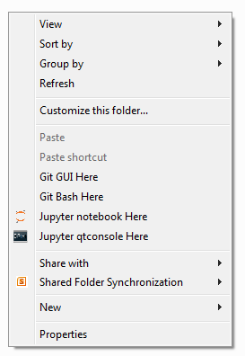
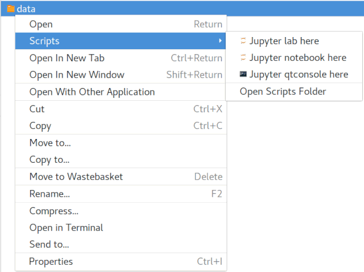

start\_jupyter\_cm
==================

|pypi_version|_  |python_version|_ |conda|_

.. |pypi_version| image:: https://img.shields.io/pypi/v/start-jupyter-cm.svg?style=flat
.. _pypi_version: https://pypi.python.org/pypi/start-jupyter-cm

.. |python_version| image:: https://img.shields.io/pypi/pyversions/start-jupyter-cm.svg?style=flat
.. _python_version: https://pypi.python.org/pypi/start-jupyter-cm

.. |conda| image:: https://img.shields.io/conda/pn/conda-forge/start_jupyter_cm.svg?style=flat
.. _conda: https://anaconda.org/conda-forge/start_jupyter_cm

Description
-----------

Add entries to start the Jupyter Notebook and QtConsole from the file
manager context menu. This offers a convenient way of starting Jupyter
in a folder. Currently it only supports Microsoft Windows, GNOME (and
its many derivatives), and macOS. Contributions to support other OSs/desktop
environments are highly welcome.

`WinPython <http://winpython.github.io>`__ and `Anaconda <https://www.anaconda.com/distribution>`__/`Miniconda <https://docs.conda.io/en/latest/miniconda.html>`__ distributions are supported. If run from a conda environment other than `root`, the name of the environment will be specified in brackets in the context menu name. 

Microsoft Windows
~~~~~~~~~~~~~~~~~

   Jupyter context menu entries in windows.

In addition to starting the QtConsole, the Jupyter Notebook or the Jupyter Lab, 
and launching the default browser, in Microsoft Windows the process runs from 
a terminal. Closing the terminal closes the QtConsole or the Jupyter server.
Single and all users installations are supported, see installation instructions below.

Linux (Nautilus and Caja)
~~~~~~~~~~~~~~~~~~~~~~~~~

   Jupyter context menu entries in gnome.

When selecting multiple folders, one instance of Jupyter
QtConsole/notebook/lab opens in each of the selected folders. Selecting a
file starts Jupyter in the file directory.

Note that on Linux the processes run in the background: to stop the jupyter
notebook or lab, don't forget to exit using the `quit` button' - only closing 
the tab will not stop the jupyter server. Alternatively, `nbmanager <https://github.com/takluyver/nbmanager>`__
can discover all running servers and shut them down using via an UI.

GNOME >= 2.22 is required.

macOS
~~~~~

.. figure:: images/jupyter_cm_macos.png
   :alt: Jupyter context menu entries in macOS
   
   Jupyter context menu entries in macOS

The context menu is only available when an object (folder or file) is 
selected in Finder. The Jupyter options will be available from the
"Services" section of the menu. If a folder is selected then an instance of 
Jupyter QTConsole/notebook/lab opens in the selected folder. If a file
is selected then Jupyter is started in the file directory. If the 
file is a jupyter notebook (\*.ipynb), then selecting Jupyter notebook/lab
will open the file in that program; Jupyter QtConsole will still only
open in the file directory.

As the processes are opened through a shell script in Automator, a spinning
cog will be visible in the menu bar when the processes are running. Once you
have finished with the server then manually kill the process via the 
drop-down menu from this spinning cog.

The launchers have been tested on macOS Mojave (10.14.6).

Installation instructions
-------------------------

Any platform
~~~~~~~~~~~~

Install from pypi using pip:

.. code:: bash

    $ pip install start_jupyter_cm

Or install from conda-forge channel using conda (in a Anaconda/Miniconda distribution):

.. code:: bash

    $ conda install -c conda-forge start_jupyter_cm

After installation, enable the context menu entries from a terminal as follows:

.. code:: bash

    $ start_jupyter_cm

To remove the context menu entries execute the following in a terminal:

.. code::

    $ start_jupyter_cm --remove

To uninstall the package:

.. code:: bash

    $ pip uninstall start_jupyter_cm

On Microscoft Windows, the administrator rights are required to add the 
entry for all users, otherwise the entries will be added only for the 
current user. In GNOME and OSX only for the current user.

Also, be aware that, uninstalling the package does not
remove the context menu entries. If you are left with the context menu
entries after uninstalling ``start_jupyter_cm``, reinstall it, remove
the entries as above and uninstall it again.

Microsoft Windows
~~~~~~~~~~~~~~~~~

In Microsoft Windows the preferred way to install this package would be
using the Windows MSI installers if it wasn't for `this Python
bug <http://bugs.python.org/issue13276>`__. Until this issue is fixed, we will
not distribute MSI installers.

Related software
----------------

-  `nbmanager <https://github.com/takluyver/nbmanager>`__ Discover and
   shutdown Jupyter servers.
-  `nbopen <https://github.com/takluyver/nbopen>`__ Open a notebook
   using your filemanager.
